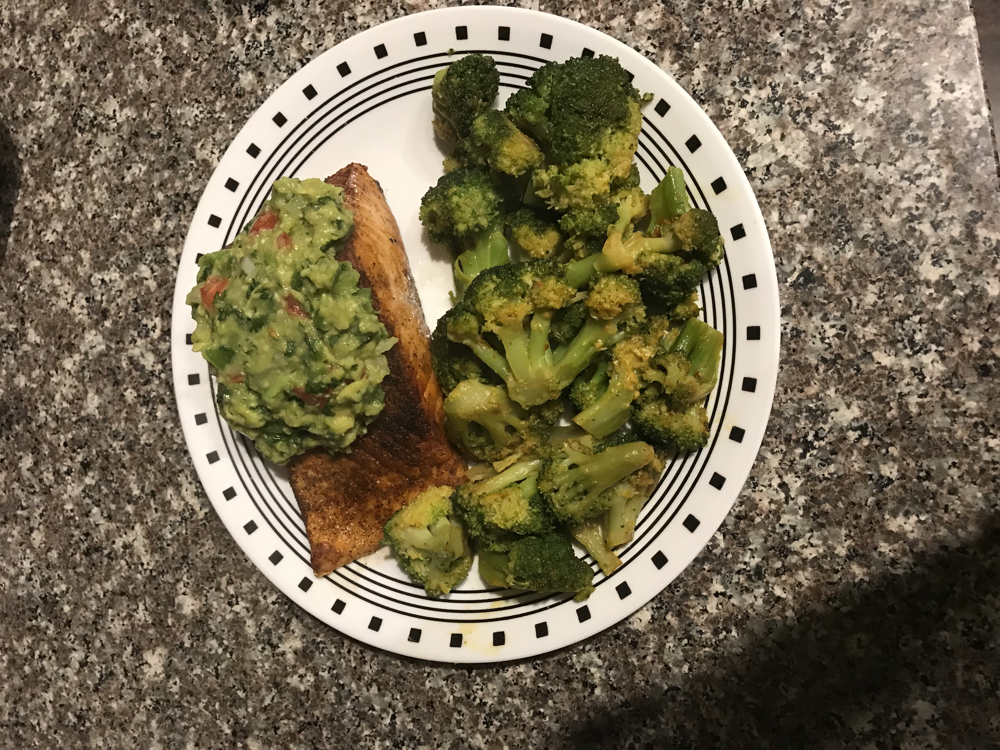

# Hobbies

# Baking

One of my hobbies is to bake desserts. Before I started to bake, I did not like cake it being overly sweet. By the cake being overly sweet, I could only focus on the sweetness of the icing rather than the combination of the icing and the cake layers themselves. Once I started to bake, I have come to enjoy cakes. They have just the right amount of sweetness and the cake layers are moist. 

# Cooking

Another one of my hobbies is cooking. I feel that it is important for everyone to know how to cook. Plus, as a college student, it is better to cook my own food that can last a week rather than spend money on meals that only last a day. One of my favorite dishes to make is salmon with homemade guacamole.

